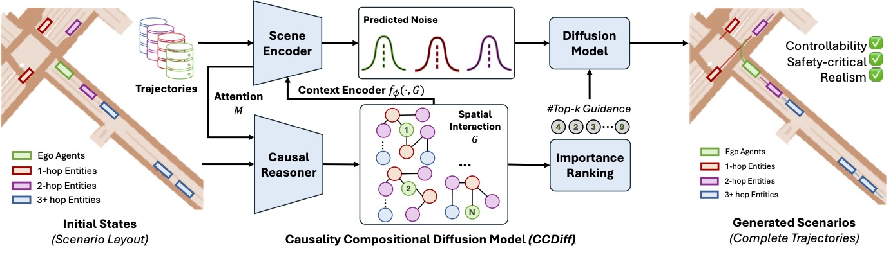
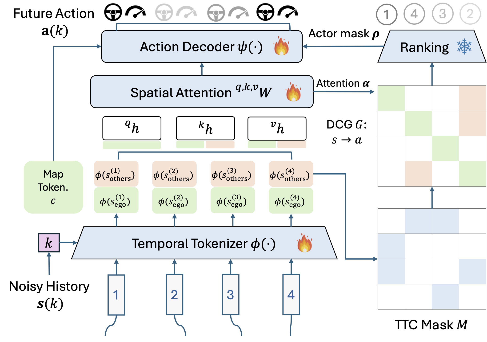

## CCDiff: Causal Composition Diffusion Model for Closed-loop Traffic Generation

#### [[Preprint]](https://arxiv.org/pdf/2412.17920) | [[Dataset]](https://www.nuscenes.org/nuscenes)

This is the source code of CCDiff, a novel structure-guided diffusion framework to address the challenges of generating realistic and controllable traffic
scenarios in long-tail situations.

### 🔍 Structure
The core structure of this repo is as follows:
```
├── ccdiff
│   ├── algos       # the training configs of each algorithm
│   ├── configs     # CCDiff's training evaluation configs
│   ├── models      # the scene encoder models for traffic generation
│   ├── utils       # the causally masked guidance loss
│   ├── policies    # hierarchical selection policies
│   ├── examples    # the training and testing scripts
├── third_party     # third party code 
│   ├── tbsim       # customized version of minimal tbsim for ccdiff support
├── data            # data for key agents detection and human evaluation
├── scripts         # the training and evluation scripts
├── fig
```





### 📝 Guidelines

#### Installation

```shell
git clone https://github.com/cruise-automation/CCDiff.git
conda create -n ccdiff python=3.8

# Install third-party dependencies
cd CCDiff/third_party

# Install trajdata
git clone https://github.com/AIasd/trajdata.git
cd trajdata
pip install -r trajdata_requirements.txt
pip install -e .

# Install Pplan
cd ..
git clone https://github.com/NVlabs/spline-planner.git Pplan
cd Pplan
pip install -e .

# Install customized version of tbsim
cd ../tbsim
pip install -r requirements.txt
pip install -e .

# Install ccdiff
cd ../../
pip install -e .

```
#### Training and Evaluation

```shell
# Run training
bash scripts/run_train.sh

# Run evaluation
bash scripts/run_eval.sh
```

#### Causal Discovery

```shell
# Extract distance and TTC files
bash extract_dist_ttc.sh

# Run causal discovery
python ccdiff/examples/causal_ranker.py
```

### 💾 Data Availability

We use the public [nuScenes dataset](https://www.nuscenes.org/nuscenes) for training and use [traffic behavior simulators](https://github.com/NVlabs/traffic-behavior-simulation) for closed-loop evaluation. 


### ❤️ Acknowledgement 

We acknowledge the following related repositories which contribute to the behavior simulation and other scenario generation baselines: 

- tbsim: https://github.com/NVlabs/traffic-behavior-simulation
- CTG: https://github.com/NVlabs/CTG/


## References
For more information about implementation, you are welcome to check our [preprint](https://arxiv.org/pdf/2412.17920). 

```bibtex
@article{lin2024causal,
  title={Causal Composition Diffusion Model for Closed-loop Traffic Generation},
  author={Lin, Haohong and Huang, Xin and Phan-Minh, Tung and Hayden, David S and Zhang, Huan and Zhao, Ding and Srinivasa, Siddhartha and Wolff, Eric M and Chen, Hongge},
  journal={arXiv preprint arXiv:2412.17920},
  year={2024}
}
```

## LICENSE
This repository is under an Apache License and the copyright owner is Cruise LLC ([license file](LICENSE)).
